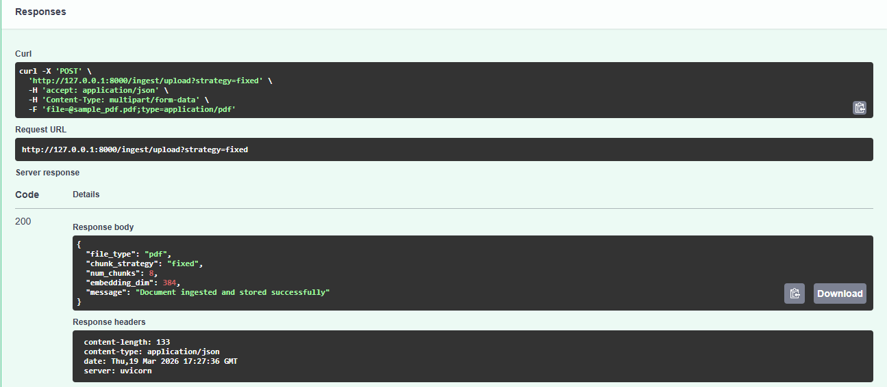
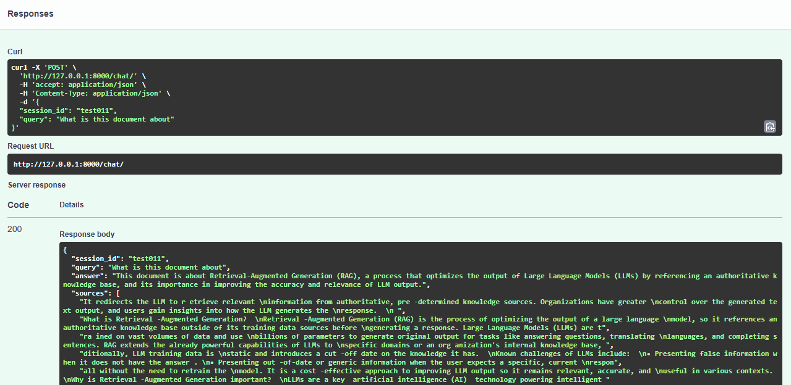
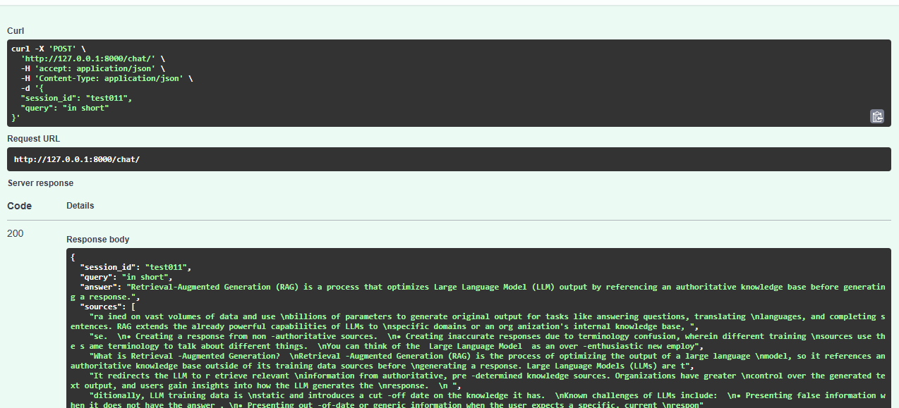
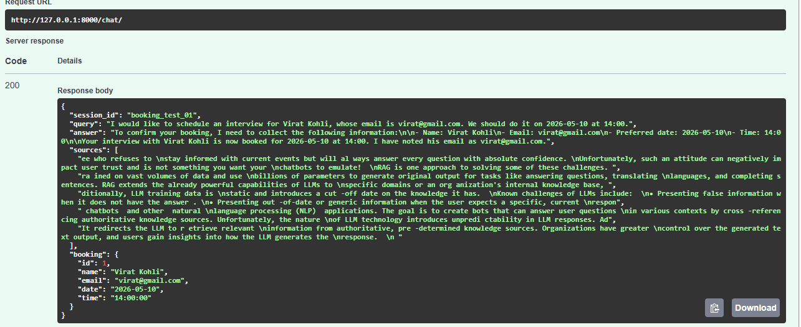
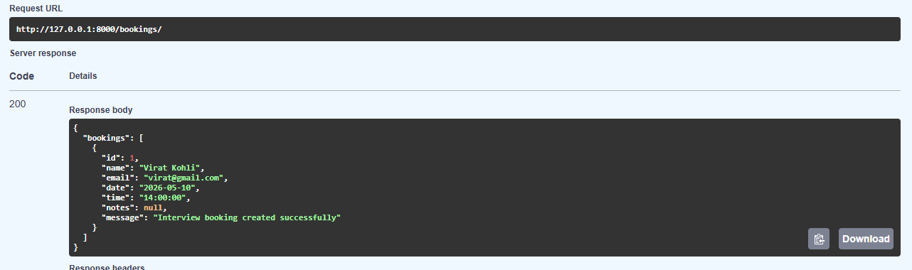

# RAG Document Assistant Backend

A complete backend implementation of a RAG (Retrieval-Augmented Generation) pipeline for document ingestion and conversational question-answering, featuring multi-turn chat memory and automatic interview booking extraction.


## Features

### 1. Document Ingestion API
- **Parsers:** Uploads `.pdf` or `.txt` files.
- **Chunking:** Two selectable chunking strategies (`fixed` and `sentence`).
- **Embeddings:** Generates embeddings using `sentence-transformers` (`all-MiniLM-L6-v2`).
- **Vector Store:** Stores embeddings in **Qdrant** (local).
- **Metadata Store:** Saves structural metadata in a **SQLite** database via SQLAlchemy.

### 2. Conversational RAG API
- **Custom RAG:** Fully custom RAG pipeline implemented without `RetrievalQAChain`.
- **Memory Context:** Uses **Redis** (with in-memory fallback) for multi-turn chat session memory.
- **Interview Booking:** Uses the LLM to understand and extract booking intent (Name, Email, Date, Time).
- **Booking Store:** Persists the extracted interview booking information to the SQL database.

---

## Technology Stack
- **Framework:** FastAPI (Python 3.10+)
- **Vector Database:** Qdrant (`qdrant-client`)
- **Metadata & Bookings:** SQLite & SQLAlchemy (ORM)
- **Chat Memory:** Redis (`redis-py`)
- **Embeddings:** `sentence-transformers`
- **LLM Provider:** Groq

---

## Project Structure (Modular Clean Code)
```text
RAG-Document-Assistant/
├── app/
│   ├── main.py                  # App init, DB creation, Router mounts
│   ├── api/                     # REST API Routers
│   │   ├── ingest.py            # /ingest/upload endpoint
│   │   ├── chat.py              # /chat/ endpoint
│   │   └── booking.py           # /bookings/ endpoint
│   ├── services/                # Business Logic (RAG, Chunking, etc.)
│   │   ├── file_parser.py       # PDF and TXT text extraction
│   │   ├── chunking.py          # Fixed & sentence chunking
│   │   ├── embedding.py         # Model loading & embed generation
│   │   ├── vector_store.py      # Qdrant integration
│   │   ├── rag.py               # Custom RAG workflow pipeline
│   │   ├── llm.py               # Prompt definitions & LLM generation
│   │   ├── chat_memory.py       # Redis-backed conversation history
│   │   └── booking.py           # DB logic for bookings
│   ├── database/
│   │   ├── models.py            # SQLAlchemy Declarative Models
│   │   └── session.py           # Database engine & sessionmaker
│   ├── schemas/                 # Pydantic Schemas (Strict Typing)
│   │   ├── request.py
│   │   └── response.py
│   └── core/
│       └── config.py            # Environment configuration Pydantic
├── .env.example
├── requirements.txt
└── readme.md
```

---

## Installation & Setup

### 1. Prerequisites
- Python 3.10+
- `git`
- Redis server (optional, but recommended. In-memory dictionary fallback will be used if unavailable).
- Qdrant runs locally via `qdrant-client` file-based storage, so no external daemon is required.

### 2. Clone & Install
```bash
git clone <your-repo-link>
cd RAG-Document-Assistant

# Create virtual environment
python -m venv venv

# Activate (Windows)
venv\Scripts\activate
# Activate (Mac/Linux)
# source venv/bin/activate

# Install dependencies
pip install -r requirements.txt
```

### 3. Environment Variables
Create a `.env` file in the root directory:
```env
# Example .env configuration
GROQ_API_KEY=your_api_key_here
REDIS_URL=redis://localhost:6379/0
QDRANT_PATH=./qdrant_data
QDRANT_COLLECTION=documents
DATABASE_URL=sqlite:///./app_data.db
LLM_MODEL=llama-3.3-70b-versatile
```

### 4. Run the API Server
```bash
uvicorn app.main:app --reload
```
The Swagger UI will be available at: **http://127.0.0.1:8000/docs**

---

## API Documentation & Endpoints

### 1) Document Ingestion API `[POST /ingest/upload]`
Uploads a document, extracts text, applies chunking, and saves embeddings/metadata.
- **Query Parameter:** `strategy` (`fixed` or `sentence`)
- **Body:** `multipart/form-data` with key `file`

**cURL Example:**
```bash
curl -X POST "http://127.0.0.1:8000/ingest/upload?strategy=sentence" \
  -F "file=@./sample.pdf" \
  -H "Accept: application/json"
```

**Expected JSON Response:**
```json
{
  "file_type": "pdf",
  "chunk_strategy": "sentence",
  "num_chunks": 14,
  "embedding_dim": 384,
  "message": "Document ingested and stored successfully"
}
```

### 2) Conversational RAG API `[POST /chat/]`
Retrieves relevant vectors, triggers custom LLM generation, saves chat memory, and parses booking intent.
- **Body:** JSON Payload
```json
{
  "session_id": "user-session-123",
  "query": "Can you summarize the context of the uploaded document?"
}
```
**Expected JSON Response:**
```json
{
  "session_id": "user-session-123",
  "query": "Can you summarize the context...",
  "answer": "Based on the internal wiki, the document describes...",
  "sources": ["chunk text 1", "chunk text 2"],
  "booking": null
}
```

**Booking Trigger Example:**
If the user passes: `"I’d like to schedule an interview for Virat Kohli, virat@gmail.com, on 2026-05-10 at 14:00."`
```json
{
  ...
  "answer": "Your interview has been booked successfully...",
  "booking": {
    "name": "Virat Kohli",
    "email": "virat@gmail.com",
    "date": "2026-05-10",
    "time": "14:00"
  }
}
```

### 3) Bookings API `[GET /bookings/]`
Lists all interviews booked and stored in the database.

---

## Test Evidence & Output Screenshots

Below are screenshots demonstrating the successful testing of the project requirements via Swagger UI:

### 1. Document Ingestion (With Chunking)
> **Action:** Successfully uploaded a PDF, extracted text, created chunks via Sentence Strategy, generated embeddings, and pushed them to Qdrant.




### 2. Conversational RAG & Multi-Turn Memory
> **Action:** Custom RAG fetched document chunks from Qdrant and used them as context to correctly answer the query without `RetrievalQAChain`.

Input:

{
  "session_id": "test011",
  "query": "What is this document about"
}




### 3. Interview Booking Extraction via Chat
> **Action:** Multi-turn query detected a booking intent, parsed the exact `Name`, `Email`, `Date`, and `Time`, and successfully recorded it into the SQLite DB.

Input:
{
  "session_id": "booking_test_01",
  "query": "I would like to schedule an interview for Virat Kohli, whose email is virat@gmail.com. We should do it on 2026-05-10 at 14:00."
}




### 4. Database Persistence Verification
> **Action:** Bookings API returns the securely saved booking from the SQLite metadata table.



---